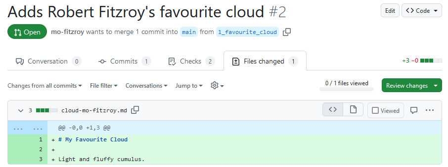
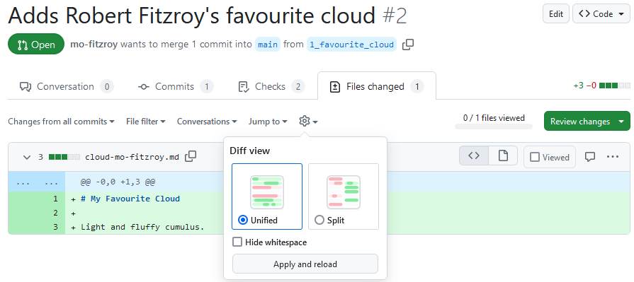
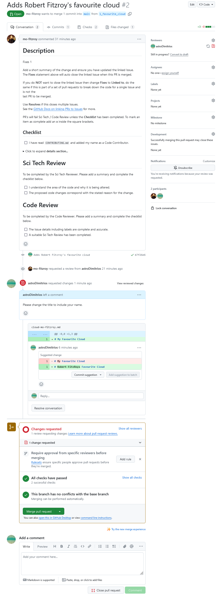
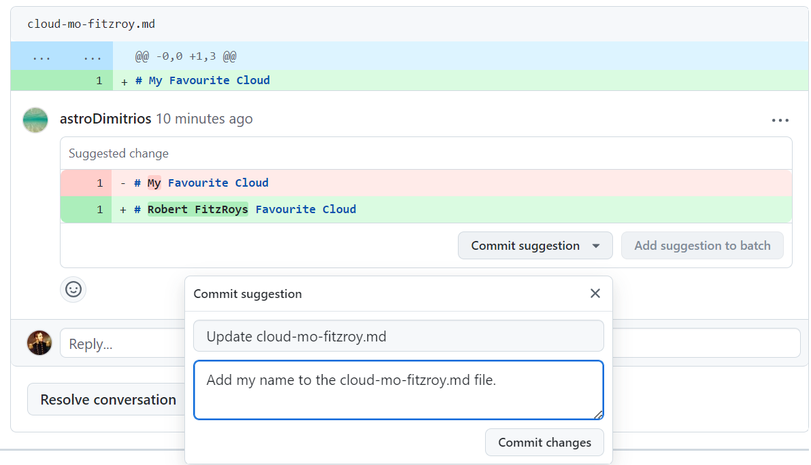
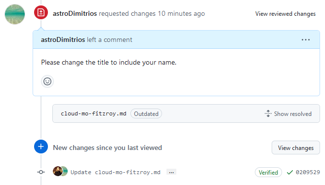
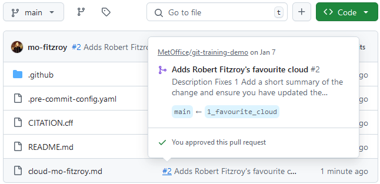

::::::::::::::::::::::::::::::::::::::: objectives

- Review changes made by collaborators.
- Respond to a review.

::::::::::::::::::::::::::::::::::::::::::::::::::

:::::::::::::::::::::::::::::::::::::::: questions

- How do I see a diff of the changes?
- How can I make inline comments or suggested changes?

::::::::::::::::::::::::::::::::::::::::::::::::::

In this section we will explore how to properly review
code and suggest changes if necessary.
Both science and code reviews happen in a Pull Request.
The general process is outlined in the diagram below:

```mermaid
sequenceDiagram
   accDescr {A sequence diagram showing the process of reviewing.}
   autonumber
   actor Developer
   actor Reviewer

   Developer->>Reviewer: Request a reviewer
   Reviewer->>Reviewer: #32;
   Note over Reviewer: Add the reviewer<br/>to the pull request
   Reviewer->>Reviewer: #32;
   Note over Reviewer: Perform the review
   loop
      Reviewer->>Developer: Submit the review
      Developer->>Developer: #32;
      Note over Developer: Respond to each<br/>review comment
      Developer->>Reviewer: Re-request a review
      Reviewer->>Reviewer: #32;
      Note over Reviewer: Respond to each review<br/>comment response
   end
   Reviewer->>Developer: Approve the pull request
```

Make sure you know who is in your pair.
Find your colleagues open PR on the `git-training-demo`
repository using the Pull Requests tab
or find the request for review in your notifications.

## Reviewing Changes

You can add general science and code review comments
in the **Conversation** tab.
To review specific files go to the **Files changed** tab:

{alt='A screenshot of a PR showing the diff in the Files changed tab. The diff is shown with Split view.'}

This tab shows a diff (difference) between your feature branch,
`1_favourite_cloud`, and the target branch, `main`.
Your diff might look different, to swap between ***Unified***
and ***Split*** view click on the cog dropdown:

{alt='A screenshot of a PR showing the diff in the Files changed tab. The cog dropdown has been clicked to show how to change the diff view between Unified and Split.'}

The default view shows a diff of the source code.
We'll stick with source code diffs for this lesson
but you can change the view to rich diffs
to display rendered changes to Markdown or Jupyter Notebook
files.
Click on the file icon on the far right of a diff for the file
to swap to a rich diff:

{alt='A screenshot of a PR showing the diff in the Files changed tab using the rich diff view.'}

To start a review you can click on the green **Review changes**
button:

{alt='A screenshot of a PR showing the diff in the Files changed tab. The Review changes button has been clicked to show the Review popup.'}

Normally it is useful to review each file one at a time
and make comments inline first before adding general comments.
Close the review popup and hover next to a line number until
it becomes highlighted.
Click on the line to add an inline comment:

{alt='A screenshot of a PR showing the diff in the Files changed tab. A line has been highlighted to show how to add an inline comment.'}

Inline comments can cover multiple lines.
Click on the first line number then drag your mouse down
to the last line your comment covers.

::::::::::::::::::::::::::::::::::::: instructor

Ensure you show learners how to create multiline comments.
It doesn't matter if learners choose to leave a single
or multiline comment/suggestion for their review.

::::::::::::::::::::::::::::::::::::::::::::::::

You can make suggested changes using inline comments.
Click on the file icon or press <kbd>Ctrl+g</kbd>:

{alt='A screenshot of a PR showing the diff in the Files changed tab. A line has been highlighted to show how to add an inline comment with a suggestion.'}

Add in a suggested change for your review.
Click on the green **Start a review** button.
Now click on the green button in the top right which says
**Finish your review** or **Review Changes**,
add a comment, and select **Request changes**.
When you're finished click the green **Submit review** button.

{alt='A screenshot of a PR showing the diff in the Files changed tab showing the review popup.'}

The PRs **Conversation** tab now looks like this
towards the bottom of the page:

{alt='A screenshot of a PR showing the Conversation tab with a review that has requested changes.'}

## Responding to Review

Now you will respond to the review on the PR that you opened.

You can see merging is blocked because our reviewer has
requested changes. You also have the option to commit the
suggested change to your branch directly via the PR.
Click on the **Commit suggestion** button.
In the popup add a description then click on **Commit changes**:

{alt='A screenshot of a PR showing the Conversation tab with a review that has requested changes.'}

You could have also committed the suggested changes
to your feature branch using your local copy,
pushed the changes to GitHub
and then marked the conversation with the suggested change as resolved.

Re-request a review by clicking on the two arrows forming a circle
next to the reviewers name at the top of the PR.

::: caution

## Help: Some checks have failed

Since our PR is running automatic checks it's best
not to make large changes by accepting suggestions this way.
Instead make changes to your feature branch using your local copy,
run the [checks locally](09-pre-commit.md),
push the changes to GitHub
and then mark the conversations with the suggested changes as resolved.
You can add a commit hash in the conversation which will automatically
link to the commit responding to any review comments.

:::

## Approving Changes

Head back to your partners PR, if they re-requested a review
you will have received another notification.

The Conversation tab should update to show the suggestion as
**Outdated** because it has been resolved.
It also gives you the option to view the new changes since your
last review.

{alt='A screenshot of a PR showing the Conversation tab with a requested change that has been resolved.'}

Click on the **View changes** button. If you are happy that
your requested changes have been addressed then
you can approve the PR:

{alt='A screenshot of a PR showing the Files changed tab showing how to Approve a review.'}

Swap back to the Conversations tab.
The PR is now ready to merge and has no conflicts with the
base (`main` in this case) branch.

::::::::::::::::::::::::::::::::::::: instructor

Important!

> Click any of the 3 merge options

The two instructors can select
squash and merge, and rebase and merge.
Some learners will have skipped ahead and already clicked
on a normal merge.
This guarantees the repository history shows all three merge types.

::::::::::::::::::::::::::::::::::::::::::::::::

Click any of the 3 merge options; don't forget to move the PR
number to the start of the commit message like you did
in the Version Control with Git lesson:

{alt='A screenshot of a PR showing the Conversations tab. The PR is ready to merge.'}

::: callout

## Who presses the merge button?

In this case both the contributor and reviewer have
write access to the repository.
This means they can both merge and close the PR
and it is up to your team to decide whether the contributor
or the reviewer does the merge as part of your working practices.

When using the forking model later the reviewer always
merges the PR as the contributor will not have sufficient permissions.

:::

When your PR is merged the Conversations tab will show:

{alt='A screenshot of a PR showing the Conversations tab. The notification tells us our PR has been successfully merged and closed.'}

You can now delete the branch from GitHub by pressing the
**Delete branch** button.
Some repositories will be automatically set up to delete
the feature branch after a PR is successfully merged.

If you head back to the main page of the `git-training-demo`
repository you will see your new file in the code view for the `main` branch.
The commit message for the PR merge is shown next to it.
If you hover over the PR number (in this case `#2`)
a popup will appear with details of the merged PR.
Click on the number to take you to the closed PR.

{alt='A screenshot of the weather repositories main Code tab showing the files in the main branch. The new shipping-forecast.md file can be seen with the commit message from the PR squash and merge commit that created it. The PR number, #4, link is being hovered over to display a popup with brief details of PR #4.'}

Head over to the repositories **Issues** tab.
Check that your Issue for adding your favourite cloud file
was closed when you merged the PR.

::::::::::::::::::::::::::::::::::::: instructor

There may not be time for learners to complete the challenge
(updating their local main branch and deleting their local feature branch).
You should update your local main branch and use `git log --oneline --graph`
to demonstrate the messy history that has been created due to
each learner selecting a random merge strategy in their PRs.

::::::::::::::::::::::::::::::::::::::::::::::::

:::::::::::::::::::::::::::::::::::::::  challenge

## Local Cleanup

In the [git-novice](https://www.astropython.com/git-novice/10-pull-requests.html#updating-your-local-repo)
lesson you learnt how to pull changes
and clean up your branches after merging a PR.

You can now:

1. Update your local copy of the `git-training-demo` repository
2. Delete any branches that are no longer necessary

:::::::::::::::  solution

## Solution

1. Update your local copy of the `git-training-demo` repository

```bash
$ git switch main
$ git pull
```

```output
remote: Enumerating objects: 4, done.
remote: Counting objects: 100% (4/4), done.
remote: Compressing objects: 100% (3/3), done.
remote: Total 3 (delta 1), reused 0 (delta 0), pack-reused 0 (from 0)
Unpacking objects: 100% (3/3), 1.07 KiB | 20.00 KiB/s, done.
From github.com:metoffice/git-training-demo
   39720d8..9bdd3b8  main       -> origin/main
Updating 39720d8..9bdd3b8
Fast-forward
 cloud-mo-fitzroy.md | 3 +++
 1 file changed, 3 insertions(+)
 create mode 100644 cloud-mo-fitzroy.md
```

2. Delete any branches that are no longer necessary

```bash
$ git remote prune origin
```

```output
Pruning origin
URL: git@github.com:metoffice/git-training-demo.git
 * [pruned] origin/1_favourite_cloud
```

```bash
$ git branch -D 1_favourite_cloud
```

```output
Deleted branch 1_favourite_cloud (was b7f26e6).
```

:::::::::::::::::::::::::

::::::::::::::::::::::::::::::::::::::::::::::::::

:::::::::::::::::::::::::::::::::::::::  challenge

## How was your PR merged?

In this episode you merged each others PRs.
The reviewer used a random merge strategy to merge each PR.

Explore the history of the repository with `git log` and find your PR merge.
How has the chosen merge strategy affected the repositories history?

::::::::::::::::::::::::::::::::::::::::::::::::::

:::::::::::::::::::::::::::::::::::::::: keypoints

- A Pull Request (PR) is where your code and science review takes place.
- General review comments go in the PR **Conversations** tab.
- View a diff of the changes in the PR **Files changed** tab.
- Make inline comments or suggested changes in the **Files changed** tab using the diff.

::::::::::::::::::::::::::::::::::::::::::::::::::
