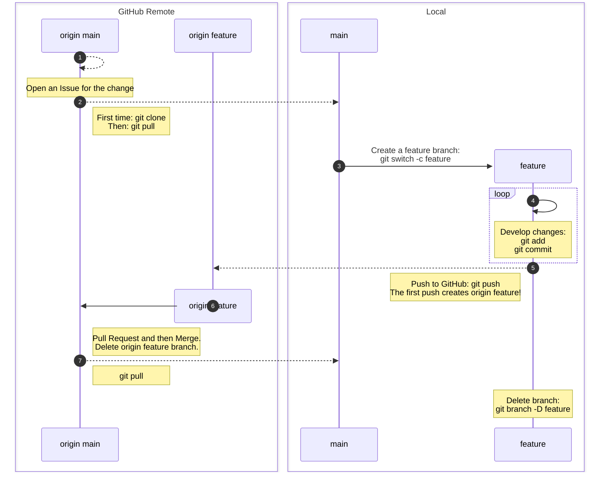

Cheat-sheet showcasing a workflow using feature branch development.
See the [Branching Models: Feature Branch](../episodes/02-branching.md#feature-branch)
section for more information.

## Summary Diagram



## Code Example

1. Open an Issue for the change
2. Clone the repository or update your local copy

   First time only:

   ```bash
   git clone <repository-ssh-url>
   cd <repository-name>
   ```

   Then after:

   ```bash
   git switch main
   git pull
   ```

3. Create a feature branch

   ```bash
   git switch -c <branch-name>
   ```

4. Develop changes

    ```bash
    git add <files>
    git commit -m "Commit message describing the change"
    ```

5. Push to GitHub

   ```bash
   git push
   ```

6. Open a Pull Request and progress through the review process,
   merging when ready and deleting the origin feature branch.

7. Update your local copy

   ```bash
   git switch main
   git pull
   ```

8. Delete the local feature branch

   ```bash
   git branch -D <branch-name>
   ```
