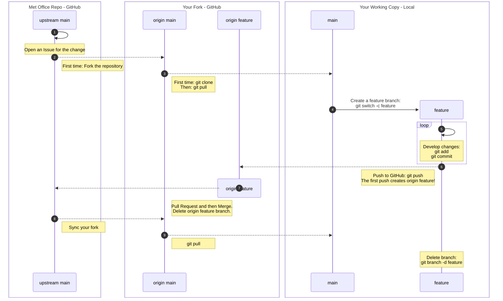

Cheat-sheet showcasing a workflow using forks,
and feature branch development within the fork.
See the [Branching Models: Forking](../episodes/02-branching.md#forking)
section for more information.

## Summary Diagram



## Code Example

1. Open an Issue for the change on the upstream repository (Met Office repository)
2. First time only:
   Fork the repository on GitHub
   by selecting the ``Fork`` button on the upstream repository homepage.
   See the [Create a Fork](../episodes/05-forks.md#create-a-fork)
   section for more information.
3. Clone your fork or update your local fork

   First time only:

   ```bash
   git clone <repository-ssh-url>
   cd <repository-name>
   ```

   Then after:

   ```bash
   git switch main
   git pull
   ```

4. Create a feature branch

   ```bash
   git switch -c <branch-name>
   ```

5. Develop changes

    ```bash
    git add <files>
    git commit -m "Commit message describing the change"
    ```

6. Push to GitHub

   ```bash
   git push
   ```

7. Open a Pull Request ensuring the target is the upstream Met Office repository.
   Progress through the review process,
   and delete the origin feature branch on your fork when the PR is merged.

8. Sync your fork

   This covers steps 8 and 9 in the diagram,
   which can be done either via GitHub or the command line.

   Use the command line option below
   if you are resolving merge conflicts
   as part of the development or review process.

   ::: tab

   ### Via GitHub

   On GitHub, navigate to your forked repository and
   select the ``Sync fork`` button.

   {alt='A screenshot of a users repository showing just the banner announcing the repository is a fork and that is up to date with the upstream repository.'}

   Then update your local copy:

   ```bash
   git switch main
   git pull
   ```

   ### Via the command line

   Switch to the main branch:

   ```bash
   git switch main
   ```

   Add the upstream repository as a remote if you haven't already:

   ```bash
   git remote add upstream <upstream-repository-ssh-url>
   ```

   Fetch the latest changes from the upstream main branch:

   ```bash
   git fetch upstream
   ```

   Merge the changes into your local main branch:

   ```bash
   git merge upstream/main
   ```

   Then update your fork on GitHub:

   ```bash
   git push
   ```

:::

10. Delete the local feature branch in your fork

   ```bash
   git switch main
   git branch -D <branch-name>
   ```
